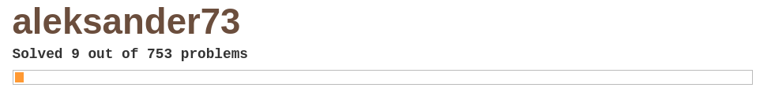
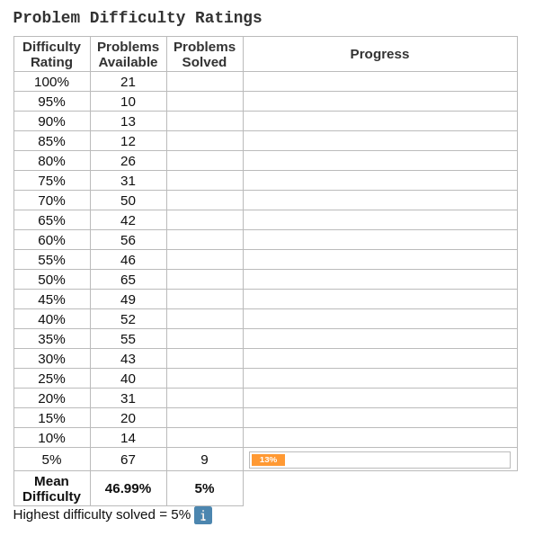

<h1 align="center"></h1>

# Index
- [Intro](#intro)
- [Problem classification](#pc)
- [My profile](#profile)
- [Interesting problem solutions](#interesting)
- [All solved problems](#problem-list)
  - [5%](#problem-list-5)

<a name="intro"/>

## Intro

<a href="https://projecteuler.net/">Project Euler</a> is an online repository containing 750+ mathematical problems. This repository is a summary of the problems I have solved so far.

<a name="pc"/>

## Problem classification

Each problem on Project Euler is assigned a percentage which aims to convey the problem difficulty. The complete list is given below.

| # | Difficulty |
| :---: | :---: |
| 1 | 100 % |
| 2 | 95 % |
| 3 | 90 % |
| ... | ... |
| 18 | 15 % |
| 19 | 10 % |
| 20 | 5 % |

Problems with the difficulty 5% are the easiest while the ones with difficulty 100% are the hardest.

<a name="profile"/>

## My profile

  

<h1></h1>

Up to date profile badge requested from Project Euler API

<h1></h1>

The GitHub repository with all problem solutions has been made private. Proof in a form of a zipped archive available on request.

<a name="interesting"/>

## Interesting problem solutions
| # | Problem | Difficulty | Reason |
| :---: | --- | :---: | --- |
| 1 | ? | ? % | ? |

<a name="problem-list"/>

## All solved problems

<a name="problem-list-5"/>

### 5 %

| # | Problem |
| :---: | --- |
| 1 | [10001st prime](https://projecteuler.net/problem=7) |
| 2 | [Even Fibonacci numbers](https://projecteuler.net/problem=2) |
| 3 | [Largest palindrome product](https://projecteuler.net/problem=4) |
| 4 | [Largest prime factor](https://projecteuler.net/problem=3) |
| 5 | [Largest product in a series](https://projecteuler.net/problem=8) |
| 6 | [Multiples of 3 and 5](https://projecteuler.net/problem=1) |
| 7 | [Smallest multiple](https://projecteuler.net/problem=5) |
| 8 | [Special Pythagorean triplet](https://projecteuler.net/problem=9) |
| 9 | [Sum square difference](https://projecteuler.net/problem=6) |
